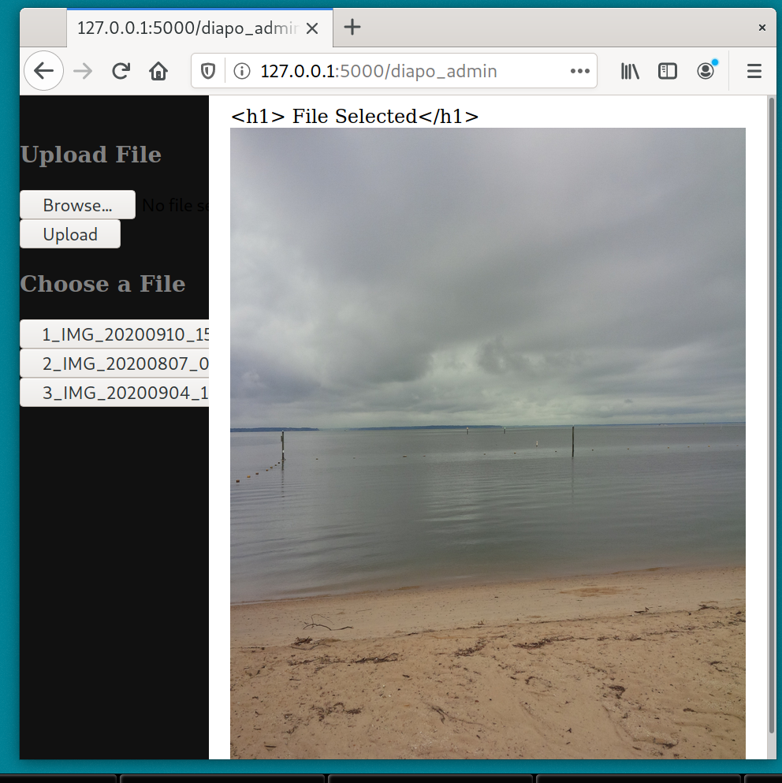

This web app is designed to serve diaporama over the internet. It is written using Python3 and the Flask framework.

## Getting started 

This requires Python3 and the flask package. To start the server, run the file webapp/diapo_flask.py with Python.

## Examples of use

The typical case of use is the situation where we have only a small internet bandwidth (or we just want to save on data usage) coupled with a cheap mean for the sound (live, speakers, fm radio, phone call).

### Example 1.

You have access to internet only through a limited data plan on your phone. Can someone call you and do a presentation?

### Example 2.

A presentation may be made over the radio and slides share over a limited internet data plan.

## User guide

### Presenter
Go to yourserver.adress/diapo_admin o create a room. In a local machine, youserver.adress is http://127.0.0.1:5000. Then uplaod images. Let us say you called your room room_name. The image you select is the image served at yourserver.adress/diapo/room_name

### Audiance 

To visite a room called room_name go to yourserver.adress/diapo/room_name. You may download the slides if you desire so.

## Elementary home page

## Accessing a room
This is done with diapo/room_name. If the room is not created, the user will be prompted to create it. 

## Register a room 

## Admin homepage 

## Admin uplaoading  files

## Viewer page
